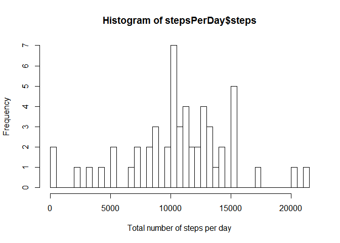
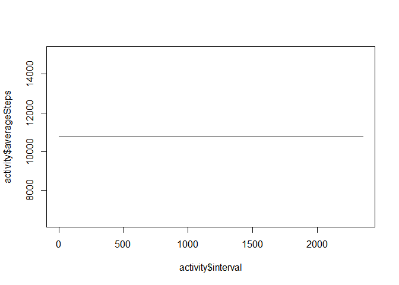
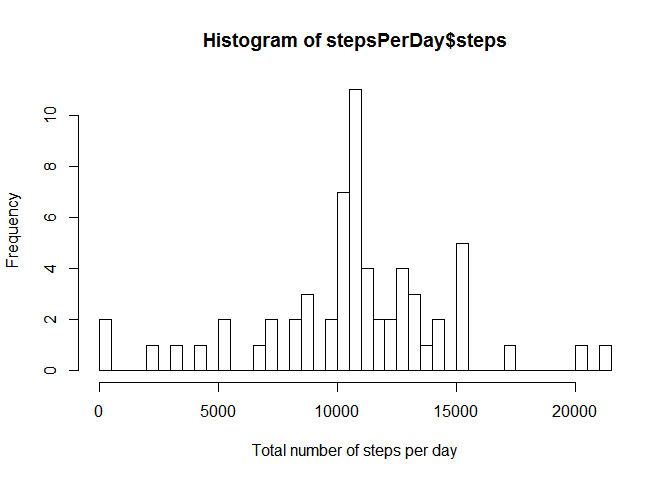
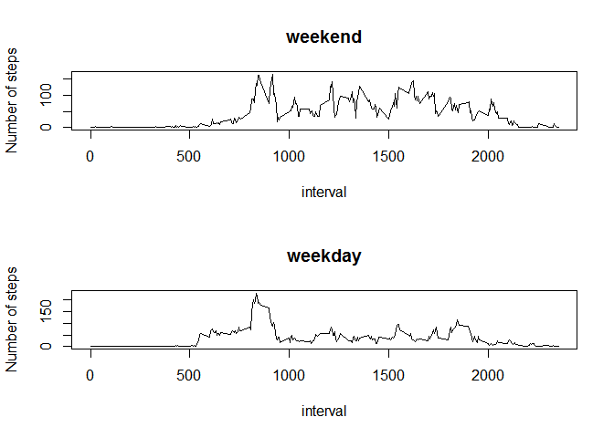

# Reproducible Research: Peer Assessment 1


## Loading and preprocessing the data


```r
#Load the data 
activity <- read.csv("activity.csv",stringsAsFactors=F)
activity$date <- as.Date(activity$date)
str(activity)
```

```
## 'data.frame':	17568 obs. of  3 variables:
##  $ steps   : int  NA NA NA NA NA NA NA NA NA NA ...
##  $ date    : Date, format: "2012-10-01" "2012-10-01" ...
##  $ interval: int  0 5 10 15 20 25 30 35 40 45 ...
```


## What is mean total number of steps taken per day?

```r
#Calculate the total number of steps taken per day
stepsPerDay <- aggregate(steps~date,activity,sum)

#Make a histogram of the total number of steps taken each day
hist(stepsPerDay$steps,xlab = "Total number of steps per day",breaks = nrow(stepsPerDay))
```

 

```r
#Calculate and report the mean and median of the total number of steps taken per day
#meanStepsPerDay <- aggregate(steps~date,activity,mean)
#medianStepsPerDay <- aggregate(steps~date,activity,median)
print("The meanStepsPerDay is")
```

```
## [1] "The meanStepsPerDay is"
```

```r
mean(stepsPerDay$steps,na.rm = T)
```

```
## [1] 10766.19
```

```r
print("The medianStepsPerDay is ")
```

```
## [1] "The medianStepsPerDay is "
```

```r
median(stepsPerDay$steps,na.rm = T)
```

```
## [1] 10765
```

## What is the average daily activity pattern?

```r
#Make a time series plot (i.e. type = "l") of the 5-minute interval (x-axis) and the average number of steps taken, averaged across all days (y-axis)
timePlot <- aggregate(steps~interval,activity,mean)
with(timePlot, plot(x = interval,y = steps,type = "l"))
```

 

```r
#Which 5-minute interval, on average across all the days in the dataset, contains the maximum number of steps?
maxStepsInterval <- timePlot[timePlot$steps== max(timePlot$steps),]
```

The 5-minute interval with maximum number of steps is 835

## Imputing missing values

```r
#Calculate and report the total number of missing values in the dataset (i.e. the total number of rows with NAs)
allNAs <- activity[is.na(activity$steps),]
nonNAs <- activity[!is.na(activity$steps),]
print("The total number of missing rows is ")
```

```
## [1] "The total number of missing rows is "
```

```r
nrow(allNAs)
```

```
## [1] 2304
```

```r
#Devise a strategy for filling in all of the missing values in the dataset. Strategy is using mean for that 5-minute interval, 
allNAs$steps[allNAs$interval==timePlot$interval] <- timePlot$steps

#Create a new dataset that is equal to the original dataset but with the missing data filled in.
newActivity <- merge(allNAs,nonNAs, all = T)
stepsPerDay <- aggregate(steps~date,newActivity,sum)

#Make a histogram of the total number of steps taken each day
hist(stepsPerDay$steps,xlab = "Total number of steps per day",breaks = nrow(stepsPerDay))
```

 

```r
#Calculate and report the mean and median total number of steps taken per day. 
print("The meanStepsPerDay is")
```

```
## [1] "The meanStepsPerDay is"
```

```r
mean(stepsPerDay$steps,na.rm = T)
```

```
## [1] 10766.19
```

```r
print("The medianStepsPerDay is ")
```

```
## [1] "The medianStepsPerDay is "
```

```r
median(stepsPerDay$steps,na.rm = T)
```

```
## [1] 10766.19
```

## Are there differences in activity patterns between weekdays and weekends?

```r
#Create a new factor variable in the dataset with two levels - "weekday" and "weekend" indicating whether a given date is a weekday or weekend day.
weekDays <- weekdays(newActivity$date,abbreviate = T)
weekDayFactor <- character()
for(i in weekDays) if(i %in% c("Sat","Sun")) weekDayFactor <- c(weekDayFactor,"Weekend") else weekDayFactor <- c(weekDayFactor,"Weekday")
newActivity$weekDay <- as.factor(weekDayFactor)

#Make a panel plot containing a time series plot (i.e. type = "l") of the 5-minute interval (x-axis) and the average number of steps taken, averaged across all weekday days or weekend days (y-axis)
par(mfrow=c(2,1))
newTimePlot <- aggregate(steps~interval+weekDay,newActivity,mean)
with(newTimePlot[newTimePlot$weekDay=="Weekend",], plot(x = interval,y = steps,type = "l",main = "weekend",ylab = "Number of steps"))
with(newTimePlot[newTimePlot$weekDay=="Weekday",], plot(x = interval,y = steps,type = "l",main="weekday",ylab = "Number of steps"))
```

 
